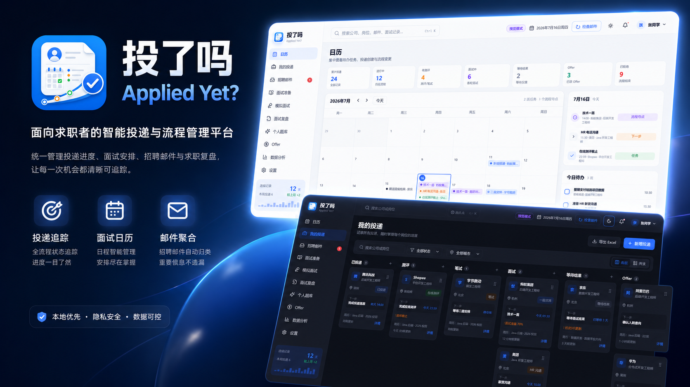
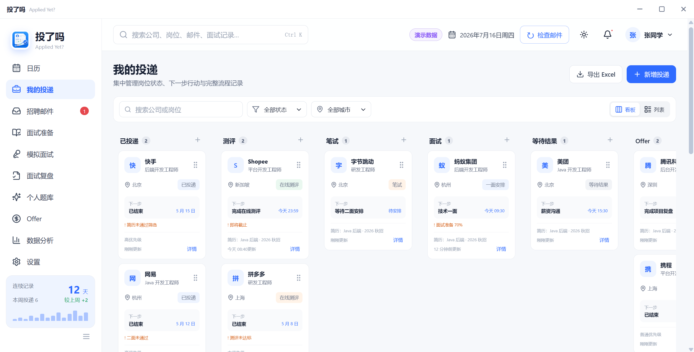
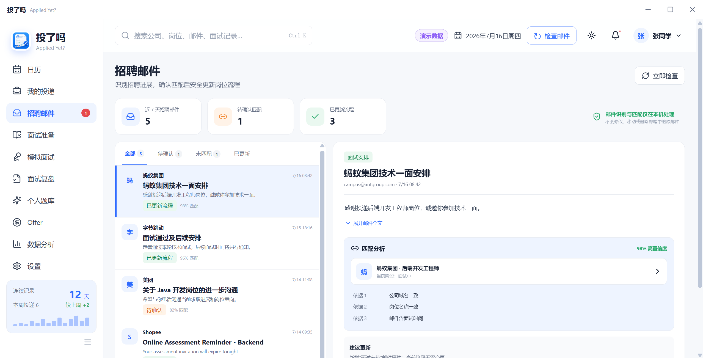
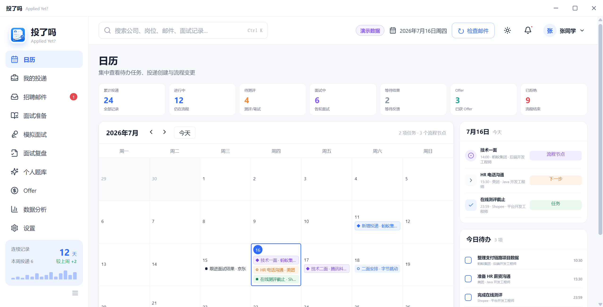
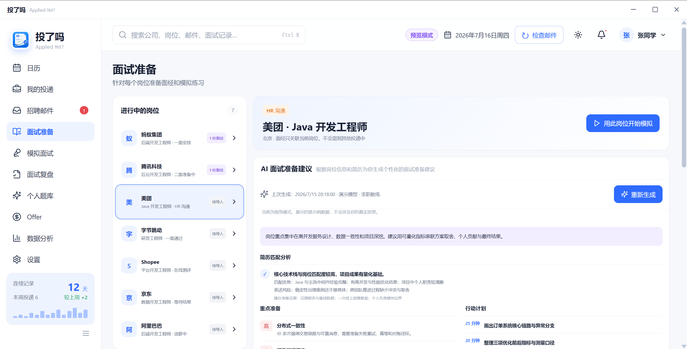
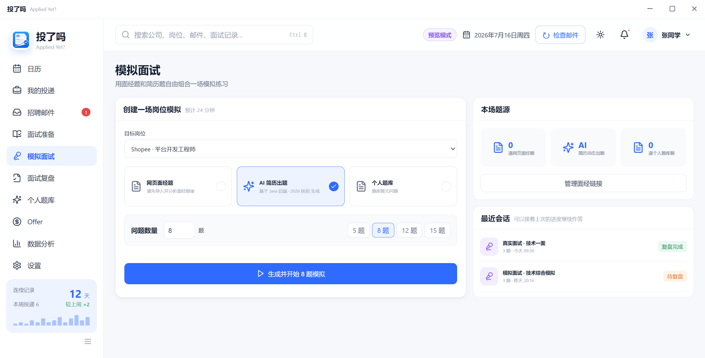
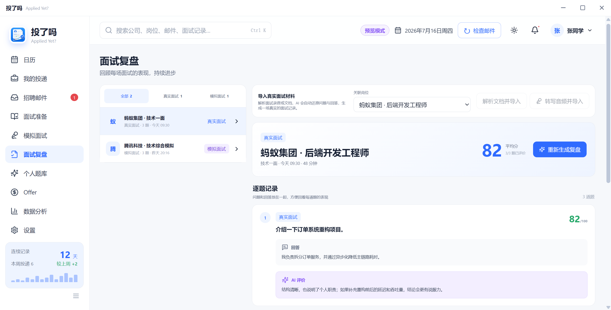
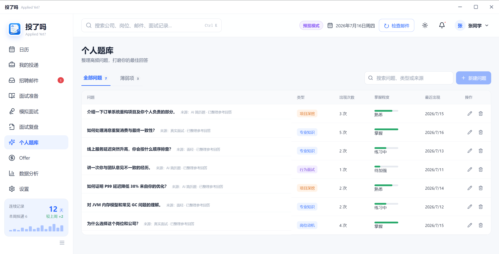
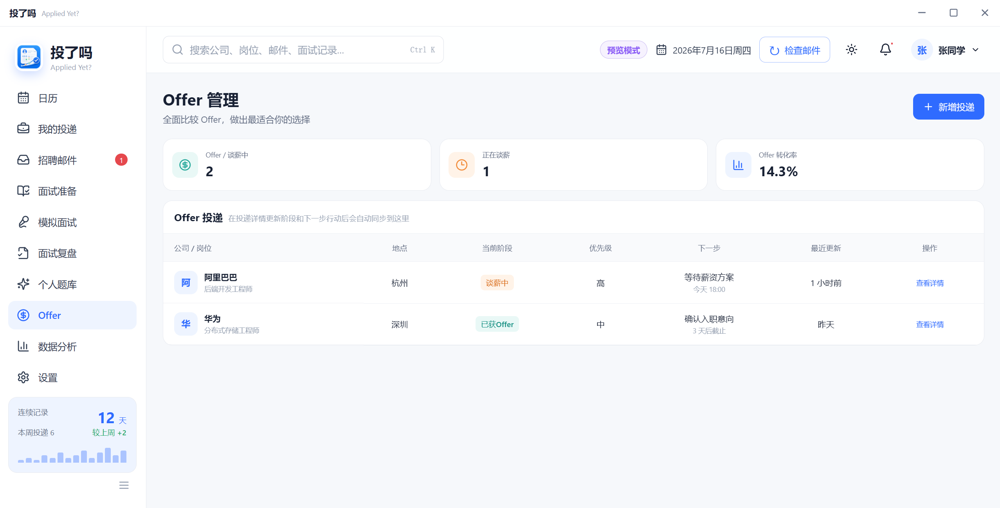
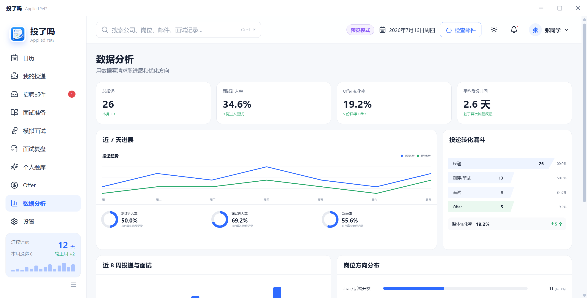

<div align="center">
  

# 投了吗 · Applied Yet?

**把散落在表格、邮件和脑海里的求职进度，放进一张清晰的地图。**

一款面向 Windows 的本地优先求职工作台：从投递记录、招聘邮件和面试日程，
到模拟面试、Offer 对比与求职复盘，一处管理，随时掌握下一步。

[查看最新版本](https://github.com/Formula404/AppliedYet/releases/latest) · [反馈问题](https://github.com/Formula404/AppliedYet/issues) · [参与开发](#参与开发)
</div>



## 求职已经够复杂，管理进度不该再添麻烦

投了哪家公司？下一轮面试是什么时候？这封邮件对应哪个岗位？哪版简历的反馈更好？

**投了吗**把一次求职拆成可追踪、可行动、可复盘的流程。你不必维护越来越长的 Excel，也不必在邮箱和日历之间来回翻找——打开应用，就能看见今天该做什么、每个机会走到了哪里。

> 数据默认保存在你的电脑上。邮箱连接、AI 与语音识别都是可选能力，由你决定是否启用、是否发送相关内容。

## 从投递到 Offer，一条线走到底

### 1. 每个机会，都有清楚的下一步

用看板或列表管理投递，记录从“准备投递”到“面试、谈薪、Offer”的每次变化。阶段、待办、备注、关联简历与历史事件都聚合在同一个岗位下，不再靠记忆补全上下文。



### 2. 让招聘邮件回到它所属的流程

可选连接招聘邮箱后，应用会增量同步并识别招聘相关邮件，尝试匹配已有投递。任何阶段更新都需要你确认，避免一封自动邮件误改整个求职进度。



### 3. 今天做什么，日历直接告诉你

笔试、面试、等待结果和自定义待办集中到日历。提醒与岗位状态互相关联，完成一项任务，也是在推进一次真实的投递。



### 4. 面试前有准备，面试后有沉淀

导入公开面经或人工整理题目，结合目标岗位与关联简历生成准备建议；再从面经、个人题库和 AI 简历题中组合一场模拟面试。真实或模拟回答可以逐题复盘，反复出现的问题会沉淀到个人题库。

<table>
  <tr>
    <td width="50%"></td>
    <td width="50%"></td>
  </tr>
  <tr>
    <td align="center">围绕岗位与简历准备</td>
    <td align="center">组合题源，随时开始练习</td>
  </tr>
  <tr>
    <td width="50%"></td>
    <td width="50%"></td>
  </tr>
  <tr>
    <td align="center">逐题回看回答与改进方向</td>
    <td align="center">把每次卡壳变成下次的底气</td>
  </tr>
</table>

### 5. 不只统计投了多少，更关心哪里有效

集中比较 Offer、薪资与意向，观察不同渠道、岗位和简历版本的转化表现。数据不是为了制造焦虑，而是帮你把精力放到更有效的行动上。

<table>
  <tr>
    <td width="50%"></td>
    <td width="50%"></td>
  </tr>
  <tr>
    <td align="center">把选择摆到同一张桌面上</td>
    <td align="center">看见求职漏斗与趋势</td>
  </tr>
</table>

## 你还可以

- 为不同岗位保存多份结构化简历，并查看各版本的投递与转化表现；
- 全局搜索公司、岗位、邮件和面试记录；
- 在浅色与深色主题之间切换；
- 将投递数据导出为 Excel；
- 手动备份、恢复或迁移本地数据目录；
- 选择 OpenAI Responses、OpenAI 兼容接口或 Anthropic 协议的 AI 服务；
- 配置语音识别，将面试录音转成可复盘的文字记录。

## 快速开始

### 安装使用

前往 [Releases](https://github.com/Formula404/AppliedYet/releases) 下载最新的 Windows 安装包。安装后可以直接使用核心的投递、日历、面试与 Offer 管理功能；邮箱、AI 和语音识别可稍后在“设置”中按需配置。

> 项目仍在积极迭代中。正式用于求职前，建议在设置中定期创建本地备份；若 Windows 显示 SmartScreen 提示，请先核对下载来源与发布说明。

### 先在浏览器里看看

仓库内置与真实数据隔离的演示模式，不会连接本地 SQLite、Windows 凭据管理器或邮箱：

```powershell
git clone https://github.com/Formula404/AppliedYet.git
cd AppliedYet
npm install
npm run dev
```

浏览器打开终端显示的本地地址即可体验示例数据。浏览器模式适合预览界面；完整的数据库、通知、邮箱和凭据能力需要运行桌面版。

## 隐私不是一句口号

投了吗采用本地优先设计：投递、任务、简历、邮件索引与面试记录保存在本机 SQLite 中，API Key、邮箱密码和 OAuth refresh token 只进入 Windows 凭据管理器，不会写入数据库备份。

- AI、ASR 与邮箱连接默认不启用；
- 简历、岗位信息或面试转写发送给外部服务前，需要相应授权；
- 可开启“每次发送前确认”，随时掌握数据去向；
- IMAP 连接要求 TLS，数据备份与恢复会执行完整性检查。

使用外部 AI、邮箱或语音服务时，相关数据仍受对应服务商的隐私政策约束。请根据自己的信息敏感程度谨慎配置。

## 参与开发

欢迎提交 Issue、功能建议和 Pull Request。项目主要位于 `apps/desktop/`，使用 React、TypeScript、Tauri 2、Rust 与 SQLite。

开发桌面版需要 Node.js 20+、npm 10+、Rust stable（MSVC toolchain）、Microsoft C++ Build Tools 和 WebView2：

```powershell
npm install
npm run tauri -- dev
```

提交变更前请运行完整检查：

```powershell
npm run check
```

构建 Windows NSIS 安装包：

```powershell
npm run tauri:build
```

更详细的目录约定、测试要求与安全注意事项请参阅 [AGENTS.md](AGENTS.md)。

---

<div align="center">
  <strong>愿每一次投递都有迹可循，每一次面试都有所积累。</strong>
</div>
